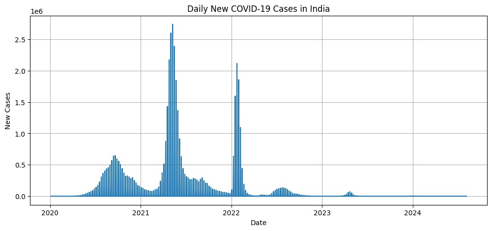
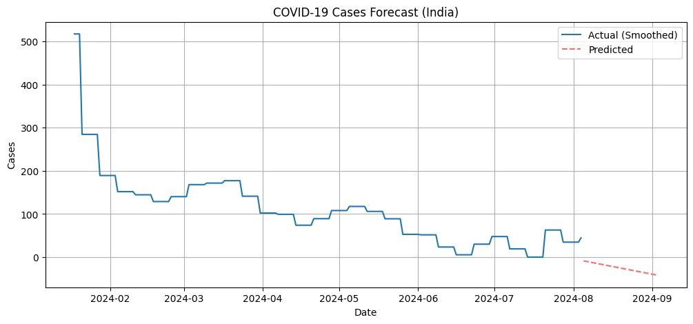

# 📊 COVID-19 Data Analysis

## 🔹 Objective
To analyze global COVID-19 trends and identify patterns in case growth, fatality rates, and country-wise impact using data analysis techniques.

## 🔹 Tools Used
- Python (Pandas, Matplotlib)
- Google Colab

## 🔹 Dataset
- Source: https://ourworldindata.org/coronavirus  
- Features used: location, date, total_cases, total_deaths, population  

## 🔹 Data Preparation
- Handled missing values in key columns
- Filtered relevant country-level data
- Created new metric: fatality_rate = (total_deaths / total_cases) * 100
- Ensured clean data for accurate visualization

## 🔹 Analysis Performed
- Country-wise COVID-19 trend analysis  
- Comparative analysis between India and the United States  
- Identification of top countries by fatality rate  

## 🔹 Key Insights
- The United States consistently recorded higher total cases compared to India, though both countries followed similar wave patterns  
- Certain countries exhibited disproportionately high fatality rates, indicating possible healthcare limitations or underreporting of cases  
- Data inconsistencies (missing values) initially impacted visualizations, highlighting the importance of proper data cleaning  
- Trend analysis revealed multiple peaks, corresponding to different waves of the pandemic  

## 🔹 Visualizations
- Line Chart: COVID-19 case trends (India vs US)  
- Bar Chart: Top 10 countries by fatality rate

##  🔹 Sample Visualization

 
 

## 🔹 Conclusion
This project demonstrates how data analysis can be used to uncover trends, compare regions, and highlight critical global patterns. It emphasizes the importance of clean data and effective visualization in understanding real-world events.

## 🔹 Future Scope
- Add interactive dashboard (Tableau / Power BI)
- Perform predictive analysis on case trends
